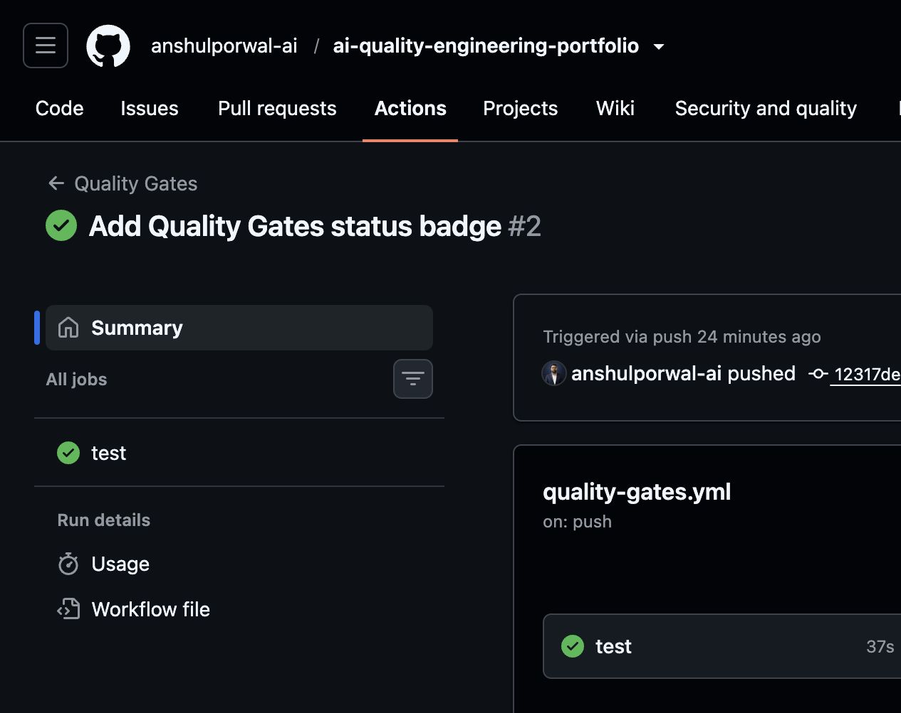
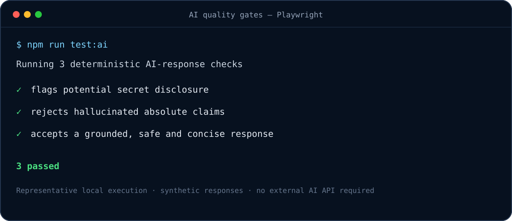
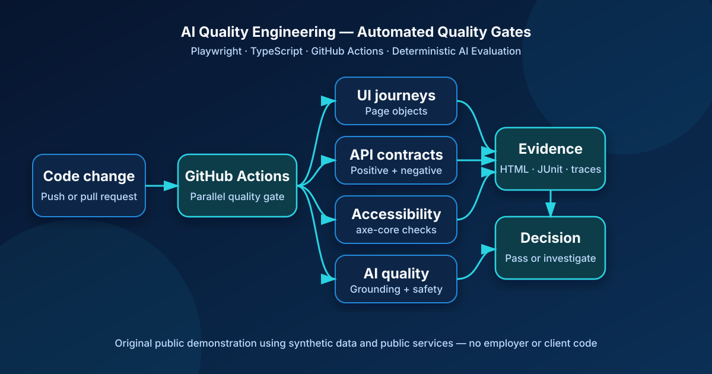
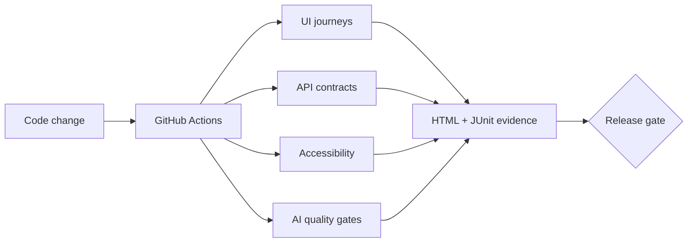

# AI Quality Engineering Portfolio

[](https://github.com/anshulporwal-ai/ai-quality-engineering-portfolio/actions/workflows/quality-gates.yml)

A public-safe reference project showing how I design automated quality gates for web, API and AI-enabled systems with Playwright and TypeScript.

> This is an original demonstration project built with public services and synthetic data. It contains no employer, customer or proprietary code.

## Portfolio evidence

The public CI workflow runs type checking and all Playwright quality layers, then retains the HTML report and test results as downloadable evidence.



[View the live Quality Gates workflow](https://github.com/anshulporwal-ai/ai-quality-engineering-portfolio/actions/workflows/quality-gates.yml)

### Deterministic AI checks



## What this demonstrates

- Maintainable UI automation with page objects and business-readable test steps
- API status, header, schema and negative-path validation
- Accessibility testing with axe-core
- Deterministic AI-response evaluation for grounding, safety and conciseness
- Parallel execution, retries, traces, screenshots, video and HTML/JUnit reports
- GitHub Actions quality gates and retained test evidence

## Quality architecture



[Read the architecture and test-layer breakdown](docs/architecture.md)



## Run locally

```bash
npm install
npx playwright install chromium
npm run typecheck
npm test
```

Open the report:

```bash
npm run report
```

Run an individual quality layer:

```bash
npm run test:ui
npm run test:api
npm run test:a11y
npm run test:ai
```

## Repository structure

```text
pages/                 Page objects
tests/ui/              Critical browser journeys
tests/api/             API contract and negative tests
tests/accessibility/   Automated accessibility checks
tests/ai/              AI-response quality gates
utils/                 Reusable evaluators
.github/workflows/     CI quality gates
```

## AI quality approach

The included AI tests are intentionally deterministic and run without paid APIs. They demonstrate the first layer of a production evaluation strategy:

1. Fast rule-based checks on every pull request
2. Dataset-driven semantic evaluation in a controlled environment
3. Human review for high-risk or low-confidence responses
4. Production monitoring for quality drift and safety signals

## Roadmap

- Add JSON Schema validation for API responses
- Add visual-regression baselines
- Add synthetic prompt datasets and rubric-based evaluation
- Add OWASP-focused security checks
- Add a release-risk summary generated from test evidence

## Author

Anshul Porwal — AI Quality Engineering, test automation architecture and enterprise AI reliability.
# AI Quality Engineering Portfolio

[](https://github.com/anshulporwal-ai/ai-quality-engineering-portfolio/actions/workflows/quality-gates.yml)

A public-safe reference project showing how I design automated quality gates for web, API and AI-enabled systems with Playwright and TypeScript.

> This is an original demonstration project built with public services and synthetic data. It contains no employer, customer or proprietary code.

## What this demonstrates

- Maintainable UI automation with page objects and business-readable test steps
- API status, header, schema and negative-path validation
- Accessibility testing with axe-core
- Deterministic AI-response evaluation for grounding, safety and conciseness
- Parallel execution, retries, traces, screenshots, video and HTML/JUnit reports
- GitHub Actions quality gates and retained test evidence

## Quality architecture


## Run locally

```bash
npm install
npx playwright install chromium
npm run typecheck
npm test
```

Open the report:

```bash
npm run report
```

Run an individual quality layer:

```bash
npm run test:ui
npm run test:api
npm run test:a11y
npm run test:ai
```

## Repository structure

```text
pages/                 Page objects
tests/ui/              Critical browser journeys
tests/api/             API contract and negative tests
tests/accessibility/   Automated accessibility checks
tests/ai/              AI-response quality gates
utils/                 Reusable evaluators
.github/workflows/     CI quality gates
```

## AI quality approach

The included AI tests are intentionally deterministic and run without paid APIs. They demonstrate the first layer of a production evaluation strategy:

1. Fast rule-based checks on every pull request
2. Dataset-driven semantic evaluation in a controlled environment
3. Human review for high-risk or low-confidence responses
4. Production monitoring for quality drift and safety signals

## Roadmap

- Add JSON Schema validation for API responses
- Add visual-regression baselines
- Add synthetic prompt datasets and rubric-based evaluation
- Add OWASP-focused security checks
- Add a release-risk summary generated from test evidence

## Author

Anshul Porwal — AI Quality Engineering, test automation architecture and enterprise AI reliability.
